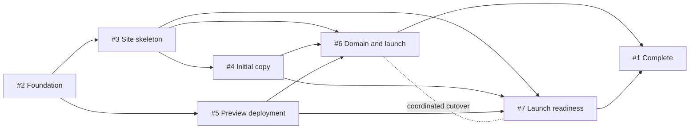

# GitHub Issue #1: Personal Website Launch

Source: [GitHub issue #1](https://github.com/erik-fryscok/erikfryscok.com/issues/1)

Implementation branch: `erikf/issue-1-launch-personal-website`

## Outcome

Deliver the first public version of the personal website through a sequenced set
of independently tracked GitHub issues. The delivery model keeps prerequisites
explicit, limits conflicting implementation work, and allows planning for the
next wave to proceed while the current wave is being implemented.

The safe work-in-progress limit is two implementation issues. A third Codex
task may prepare a decision-complete plan for the next issue, but it must not
change product code until that issue's prerequisites are complete.

## Planning approach

Use just-in-time issue planning rather than preparing detailed plans for every
sub-issue at the beginning of the initiative:

1. Maintain this initiative-level sequencing and dependency plan.
2. Create a separate branch and isolated worktree for each child issue.
3. Write and post that issue's detailed plan immediately before its execution
   wave.
4. Implement the issue on the same branch after its plan is accepted.
5. Merge prerequisite issues before beginning dependent implementation.

This lets later plans reflect the actual framework, page, deployment, and
content contracts established by earlier work.

The detailed plan for
[GitHub issue #2](https://github.com/erik-fryscok/erikfryscok.com/issues/2)
already exists on
`erikf/issue-2-astro-typescript-tailwind-foundation` and should not be
recreated.

## Codex model and reasoning recommendation

Use `gpt-5.6-sol` as the primary model for the initiative. It is the current
frontier-capability model in the GPT-5.6 family and is the best fit for
multi-step coding work that combines planning, implementation, tool use, and
validation.

Use these settings for each class of work:

| Work | Model | Reasoning effort | Rationale |
| --- | --- | --- | --- |
| Initiative orchestration and child-issue planning | `gpt-5.6-sol` | `high` | Resolve scope, dependencies, boundaries, and acceptance criteria before implementation. |
| Issues #2, #3, and #5 | `gpt-5.6-sol` | `high` | Protect the shared application and deployment foundations while checking implementation trade-offs and edge cases. |
| Issue #4 | `gpt-5.6-sol` | `medium` | Content integration is well bounded once #3 establishes the page contract; raise to `high` if positioning or privacy decisions remain ambiguous. |
| Issues #6 and #7 | `gpt-5.6-sol` | `xhigh` | Use deeper reasoning for DNS, production cutover, accessibility, SEO, launch validation, and release closeout. |
| Bounded read-heavy helpers | `gpt-5.6-terra` | `medium` | Favor speed and efficiency for repository scans, documentation review, test-log analysis, and other work that returns a distilled result to the primary agent. |

Do not default to `max`: reserve it for a specific unresolved, quality-first
problem after `xhigh` proves insufficient. Keep write ownership with the
primary `gpt-5.6-sol` agent and use `gpt-5.6-terra` only for independent
read-heavy support work so parallel execution does not create conflicting
changes.

These recommendations were verified against the official
[GPT-5.6 model guidance](https://developers.openai.com/api/docs/guides/latest-model?model=gpt-5.6)
and [Codex subagent guidance](https://learn.chatgpt.com/docs/agent-configuration/subagents)
on 2026-07-23. Recheck the available Codex model lineup before starting a
future execution wave if these names or effort levels are no longer available.

## Dependency graph

The formal GitHub dependency relationships are:

- #3 is blocked by #2.
- #4 is blocked by #3.
- #5 is blocked by #2.
- #6 is blocked by #3, #4, and #5.
- #7 is blocked by #3, #4, and #5.

There is intentionally no blocking relationship between #6 and #7. They form a
coordinated launch pair: perform #7's pre-launch checks, complete the #6
production cutover, then finish #7's production checks and release-note
validation.

## Execution waves

### Wave 1: foundation

Implement #2 from its existing plan. Do not include the five-page site,
Cloudflare Pages configuration, initial production copy, or launch work.

While #2 is in progress, planning-only work may begin for #3 and #5.

### Wave 2: site skeleton and preview deployment

After #2 is merged, implement #3 and #5 concurrently in separate branches and
worktrees:

- #3 establishes the first-release routes, layout, navigation, and responsive
  page structure.
- #5 establishes the Cloudflare Pages preview delivery path using the build
  contract delivered by #2.

Prepare #4's detailed plan while this wave is in progress, but do not implement
it until #3 establishes the page and layout contract.

### Wave 3: initial content

After #3 is merged, implement #4 against the real page structure. Keep
publishable copy and selected work within the documented positioning and
content-safety boundaries.

Prepare the detailed #6 and #7 plans while #4 is in progress. Those plans must
use the actual preview deployment, page content, and validation commands
delivered by earlier waves.

### Wave 4: coordinated public launch

After #3, #4, and #5 are merged, execute #6 and #7 concurrently:

- #7 performs accessibility, SEO, link, responsive, and pre-launch readiness
  checks against the preview deployment.
- #6 confirms domain ownership and DNS requirements, prepares the production
  deployment, and performs the approved cutover.
- #7 then verifies the production deployment and confirms the release notes.

DNS changes and the production-domain cutover require explicit approval before
execution.

### Initiative closeout

Close #1 only after:

- #6 and #7 are complete.
- The site is available on the personal domain over HTTPS.
- The `v1.0.0` release notes accurately describe the launch.
- The public-launch milestone can be closed.

## Child-issue delivery contract

For each child issue:

- Branch from the latest appropriate `main` using
  `erikf/issue-N-short-description`.
- Use an isolated worktree when another issue is active concurrently.
- Add a decision-complete repository plan and post it to the source issue
  before implementation begins.
- Keep implementation, tests, documentation, and validation evidence within
  the issue's stated boundaries.
- Link the pull request with `Closes #N`.
- Complete relevant automated checks, documentation-link validation,
  `git diff --check`, and the public-repository privacy review.
- Update documentation, the decision log, or `CHANGELOG.md` when the issue
  changes product intent, an established decision, or user-visible behavior.

Avoid stacked implementation branches except during review. If a prerequisite
changes while a dependent issue is being planned, refresh the dependent plan
from the merged implementation before coding.

When this initiative plan is eventually merged into `main`, incorporate updated
`main` into the existing issue #2 branch additively rather than rewriting that
branch's history.

## Source-of-truth boundaries

This document records durable sequencing, concurrency, dependency, and launch
gates. GitHub remains authoritative for live status, dates, assignments,
milestone scope, and delivery discussion. Do not duplicate those changing
values here.

This plan introduces no application API, schema, migration, runtime
configuration, or public-site behavior.
